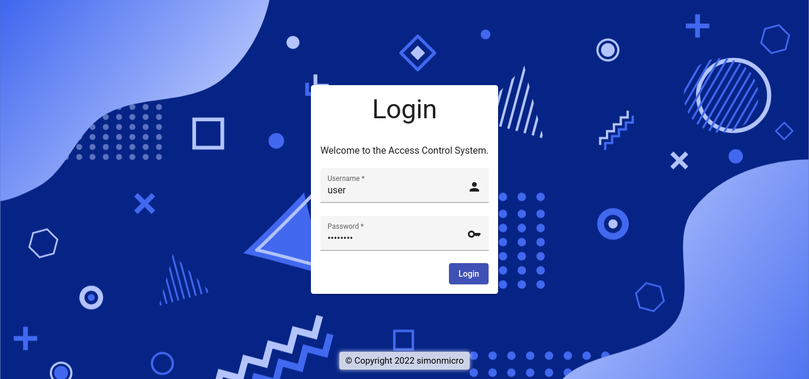
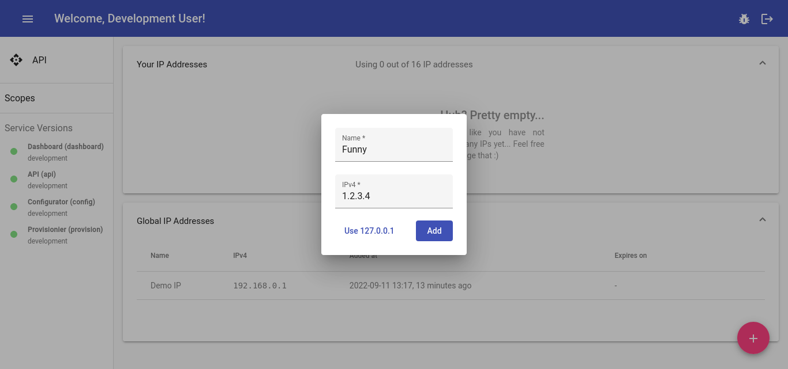

# What is this?




This application was developed to work inside a cloud-native environment (Kubernetes!) and to protect its web-applications with an additional layer of security.

There is no need for e.g. a VPN-client on the _users_ side, instead their requests will simply be rewritten to the authentication layer of this software. This solution is not perfect and only meant as an additional of security: It works by whitelisting _users_ public IPv4 for a set of _scopes_ (like `stuff.example.com`) by providing a list of IPv4-addresses for the use inside configmaps (e.g. for use inside Nginx). It therfore works best for "small" amount of _users_ only.

## Services
* `api` Provides a REST-ful endpoint with WebSockets and documentation
* `config` Applies a given YAML to the database (supports live changes)
* `dashboard` Provides a static set of files as the dashboard, expects the path `/api` to be routed to the `api` service - to change that (e.g. to use an own sub-domain for the api), you have to compile the dashboard yourself...
* `provision` This container uses the `kubectl` command to apply changes to the pods and configmaps

## Getting started

### API, Dashboard & more
All services (except the `dashboard`) need access to a Redis database instance. To run such instance locally, try this (according to its [documentation](https://hub.docker.com/_/redis)):

```bash
docker run -v "$(pwd)/redis:/data" -p 6379:6379 redis redis-server --save 60 1 --loglevel warning
```

To configure the services to use this instance, take a look into the `.gitlab/*/Dockerfile` files for the services environment variables.

As you may have noted, the service `config` expects a YAML file to prepare the _scopes_ and _users_. Take a look into the `config.sample.yaml` to learn more!

You then have to expose the `dashboard` and `api` services to the _users_ by e.g. using a Nginx instace as a reverse proxy. For the `dashboard` just proxy requests to the `dashboard` service and for the `api`, ensure the path `/api` of your Nginx is proxied to the `api` service (take a look at [Uvicorn Deployment](https://www.uvicorn.org/deployment/#running-behind-nginx) and the api environment variables).

**Rate limits** are strongly recommended to add an additional layer of security to your api endpoint! Here is an example for a Nginx configuration of the `dashboard` with the `api` service mapped to `/api`:

```nginx
limit_req_zone $binary_remote_addr zone=access_api_limit:10m rate=4r/s;

server {
    listen 443 ssl;
    server_name access-control.example.com;

    ssl_certificate ...;
    ssl_certificate_key ...;

    location / {
        set $endpoint dashboard-service.default.svc.cluster.local;
        resolver kube-dns.kube-system.svc.cluster.local;
        proxy_pass http://$endpoint;
    }

    location /api/ {
        # -> https://stackoverflow.com/a/33325584
        rewrite ^/api/(.*) /$1  break;
        resolver kube-dns.kube-system.svc.cluster.local;
        proxy_pass http://api-service.default.svc.cluster.local$uri$is_args$args;
        # Limit interaction to the API
        limit_req zone=access_api_limit burst=32 delay=8;
        limit_req_status 429;
        # Inform target host about proxy client...
        proxy_set_header Host $host;
        proxy_set_header X-Real-IP  $remote_addr;
        proxy_set_header X-Forwarded-For $proxy_add_x_forwarded_for;
        proxy_set_header X-Forwarded-Proto $scheme;
        proxy_set_header X-Forwarded-Protocol $scheme;
        proxy_set_header X-Forwarded-Host $http_host;
        # Support WebSocket connections...
        proxy_http_version 1.1; # Default is 1.0
        proxy_set_header Upgrade $http_upgrade;
        proxy_set_header Connection "upgrade";
        # Wait for x seconds for the uplink...
        proxy_connect_timeout 1d; # Keep websockets alive!
        proxy_send_timeout 1d; # Keep websockets alive!
        proxy_read_timeout 1d; # Keep websockets alive!
        send_timeout 10;
    }
}
```

### Configure your Nginx
The `provision` service of this project is compartible with Nginx and its `geo_ip` module. This is achieved by updating a configmap inside the Kubernetes cluster, which holds a list of IPs for the configured _scopes_. As you may have noted, Nginx does not reload the configuration files on its own if any change occurs. For this a small sidecar is required (e.g. below). Furthermore, you also have to configure your Nginx to respect the lists from the (then mounted) configmap. See below for an example too.

Nginx with a sidecar for automatic reloads:
```yaml
apiVersion: apps/v1
kind: DaemonSet
metadata:
  name: nginx
spec:
  selector:
    matchLabels:
      app: nginx
  template:
    metadata:
      labels:
        app: nginx
    spec:
      shareProcessNamespace: true # Required for sending the reload signal to Nginx
      containers:
      - name: config-reloader
        image: realsimonmicro/debian-inotifywait
        # Do NOT listen to all events, otherwise you will get stuck in a loop (because NGINX will trigger "close" after reading them with "access").
        args: ["-c", "echo 'Ready to go!'; inotifywait -e modify -e create -e modify -e delete -m -q -r --format '%w%f' '/geo_ips/' | while read -r path; do echo \"$(date): $path changed!\"; echo \"\tSkipping $(timeout 3 cat | wc -l) further changes...\"; kill -s HUP $(pgrep -o nginx); done"]
        volumeMounts:
        - name: nginx-config-geo-ips-volume
          mountPath: /geo_ips/
          readOnly: true
      - name: nginx
        image: nginx
        volumeMounts:
        - name: nginx-config-geo-ips-volume
          mountPath: /geo_ips/
          readOnly: true
        ports:
        - containerPort: 80
        - containerPort: 443
      volumes:
      - name: nginx-config-geo-ips-volume
        configMap:
          name: nginx-config-geo-ips
```

Nginx configuration for `geo_ip` lists from `/geo_ips/dummy.list`:
```nginx
geo $dummy_list {
    include /geo_ips/dummy.list;
}

server {
    listen 443 ssl;
    server_name service.example.com;

    ssl_certificate ...;
    ssl_certificate_key ...;

    location / {
        if ($dummy_list = 1) {
            # root /success;
            # ...or use inline HTML...
            add_header Content-Type text/html;
            return 200 '<html><body><h1>Access granted!</h1></body></html>';
        }
        if ($dummy_list != 1) {
            # You can also use the "rewrite" instead of the "root" (or whatever) statement to directly send the user to the access-control webinterface.
            # Make sure to insert the external reachible hostname below!
            # rewrite ^ $scheme://EXTERNAL_HOSTNAME_OF_INTERFACE/request/$scheme/$host$uri$is_args$args redirect;

            # root /failure;
            # ...or use inline HTML...
            add_header Content-Type text/html;
            return 403 '<html><body><h1>Access denied!</h1></body></html>';
        }
    }
}
```